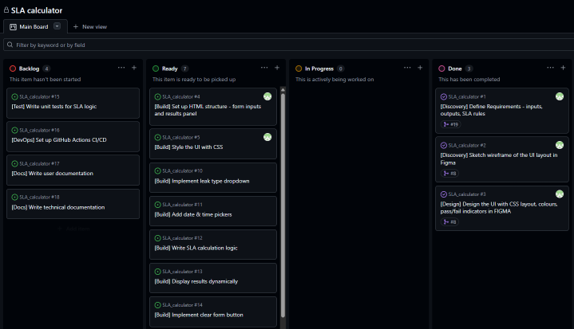
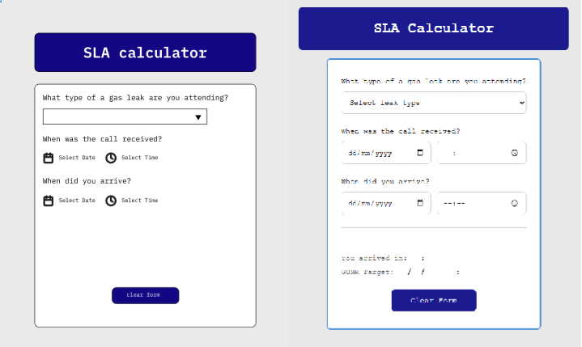
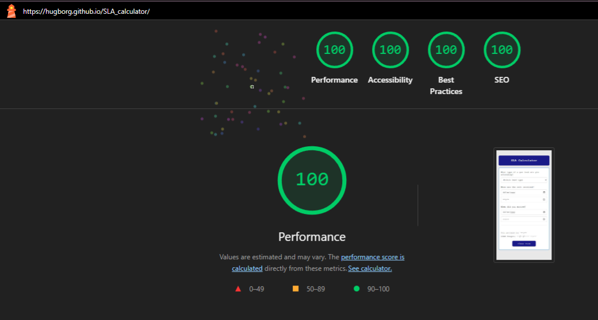

# SLA calculator for gas engineers 🛠️

🔗 [Open SLA Calculator](https://hugborg.github.io/SLA_calculator/)

This repository contains code and documentation for Summative One assessment in Software Engineering. 
Created by Hugborg Hudson.

---
## 1. Product Proposal ✨
The SLA Calculator is a lightweight, browser-based tool designed to help gas engineers quickly determine whether they attended a gas leak callout within their required Service Level Agreement (SLA) window.

When attending gas leak callouts, engineers are required to arrive within a set timeframe determined by the nature of the leak. These timeframes, defined under GSMR (Gas Safety Management Regulations), vary depending on whether the leak is classified as Controlled, Uncontrolled, or Priority. Currently, determining SLA compliance requires manually calculating the difference between the time a call was received and the time of arrival, then comparing it against the relevant target. This process is error-prone, time consuming, and adds unnecessary pressure in an already high stakes environment.

The SLA Calculator removes the mental arithmetic entirely. The engineer selects the leak type, inputs the time the call was received, and inputs their arrival time. The app instantly calculates whether they arrived within the SLA timeframe, displays the time taken to arrive onsite, and shows the exact deadline they are working towards for turning off the leak. The result is a clear, unambiguous compliance status, either within or outside the SLA.

This tool is intended for gas engineers and their supervisors who need a fast, reliable way to check or record SLA compliance during or after attending a callout. It is designed to work on any device, phone, tablet or desktop with no installation required.

The app is built using HTML, CSS, and JavaScript. This keeps it entirely dependency-free, accessible from any browser, and simple to maintain. No backend or database is needed for the MVP, as the tool performs all calculations client side.

## 2. Design and Prototype 🎨

### Wireframe

Before any code was written, an initial wireframe was produced to map out the structure and layout of the SLA Calculator. This helped clarify the user flow and identify the key inputs and outputs needed for the MVP.


*Figure One: Showing the wireframe for the App Layout*
    
The wireframe outlines the core layout of the SLA Calculator. A dropdown at the top allows the engineer to select the leak type, followed by two date and time input pairs for the call received and arrival times. The results section at the bottom dynamically displays the compliance status, time taken, and GSMR target deadline. A clear form button allows the engineer to reset all fields quickly.
    
### Prototype

Following the wireframe, a high-fidelity prototype was built in Figma to visualise the final look and feel of the application before development began. The prototype demonstrates the intended user flow, from selecting 
a leak type through to receiving a compliance result.


*Figure Two: Showing the gif of the prototype for the App functionality*
 
The prototype builds on the wireframe by applying visual styling and simulating interactions, including the dynamic display of the SLA result. This allowed the design to be reviewed and refined before writing any code, 
reducing the risk of layout changes during development.

### Design Decisions

- **Simplicity First:** The layout is intentionally minimal. Engineers use this tool quickly, often in the field, so a clean single-page design with no navigation was prioritised.
- **Clear result visibility:** The compliance result is displayed prominently below the inputs so the outcome is immediately obvious without scrolling.
- **Mobile Friendly layout:** The form is structured vertically to work naturally on both mobile and desktop devices.

## 3. Project Management📅

This project was managed using an Agile methodology, broken down into three sprints. Each sprint had a defined set of goals, allowing the project to be built incrementally and reviewed at each stage before moving forward. This approach kept development focused and made it easier to identify and address issues early before progressing to the next phase.

### Tool - GitHub Projects

GitHub Projects was used as the project management tool throughout development. It was chosen because it integrates directly with the repository, meaning issues, branches, and pull requests are all visible in one place without needing to switch between tools. 

The board was structured using the following columns:
| Column | Purpose |
|---|---|
| Backlog | Tasks identified but not yet ready to start |
| Ready | Tasks fully defined and ready to be picked up |
| In Progress | Tasks actively being worked on |
| Done | Fully completed and merged tasks |

The screenshot below shows the board at the start of Sprint 2, with Sprint 1 completed and all build tickets loaded into the Ready column.



*Image Three: Showing a screenshot of the project board*

### Sprints

**Sprint 1 — Discovery & Design**

The first sprint focused on understanding the problem, defining the 
requirements, and producing the visual design before any code was written.

- #1 Define Requirements — inputs, outputs, SLA rules
- #2 Sketch wireframe of the UI layout in Figma
- #3 Design the UI with CSS layout, colours, pass/fail indicators in Figma

**Sprint 2 — Build**

The second sprint covered the full development of the MVP, building the 
HTML structure first, then applying styling, and finally implementing all 
interactive functionality.

- #4 Set up HTML structure — form inputs and results panel
- #5 Style the UI with CSS
- #10 Implement leak type dropdown
- #11 Add date and time pickers
- #12 Write SLA calculation logic
- #13 Display results dynamically
- #14 Implement clear form button

**Sprint 3 — Testing, CI/CD & Documentation**

The third sprint focused on quality assurance, automated testing, and 
completing all documentation.

- #15 Write unit tests for SLA logic
- #16 Set up GitHub Actions CI/CD
- #17 Write user documentation
- #18 Write technical documentation

## 4. Requirements / Tickets 🎫

### Functional Requirements 

The following table captures the functional requirements for the SLA Calculator MVP. Each requirement describes what the application must do from the user's perspective.

| ID | Requirement | Priority |
|---|---|---|
| FR-01 | The user must be able to select a gas leak type (Controlled, Uncontrolled, Priority) | High |
| FR-02 | The user must be able to input the date and time the call was received | High |
| FR-03 | The user must be able to input the date and time they arrived on site | High |
| FR-04 | The app must calculate the time difference between call received and arrival | High |
| FR-05 | The app must compare the calculated time against the GSMR target for the selected leak type | High |
| FR-06 | The app must display whether the engineer arrived within or outside the SLA | High |
| FR-07 | The app must display the time taken and the GSMR target deadline | Medium |
| FR-08 | The user must be able to clear all inputs and reset the form | Medium |
| FR-09 | The app must be usable on both mobile and desktop devices | Medium |

### Non-Functional Requirement

The following table captures the non-functional requirements.

| ID | Requirement |
|---|---|
| NFR-01 | The app must run entirely in the browser with no backend or installation required |
| NFR-02 | The app must produce a result instantly upon all inputs being completed |
| NFR-03 | The codebase must include unit tests for the core calculation logic |
| NFR-04 | The project must use CI/CD to run tests automatically on every push |

### SLA Rule Reference

| Leak Type | GSMR Target |
|---|---|
| Priority | 1 hour |
| Uncontrolled | 1 hour |
| Controlled | 2 hours |

### Tickets

All tickets are managed on the [GitHub Projects board](https://github.com/users/hugborg/projects/2/views/1). Each ticket represents a single feature or task, correspond to branches that are merged via pull requests. The tickets are organised into the following types:

| Prefix | Type | Description |
|---|---|---|
| `[Discovery]` | Discovery | Research, planning and design tasks |
| `[Design]` | Design | UI and visual design tasks |
| `[Build]` | Build | Development and implementation tasks |
| `[Test]` | Test | Testing and quality assurance tasks |
| `[DevOps]` | DevOps | CI/CD and infrastructure tasks |
| `[Docs]` | Documentation | User and technical documentation tasks |

## 5. Build Narrative 📜

This section documents the step by step process of building the SLA Calculator MVP, from the initial HTML structure through to a fully functional application.

### Step 1 - HTML Structure

The build began with the HTML skeleton, establishing the core structure of the application before any styling or logic was added. This included the header, the calculator card, all form inputs, the results panel, and the clear form button. The results panel was given a 'hidden' attribute by default so it would only appear once a valid calculation has been made. Separate files for style.css and script.js were also scaffolded at this stage, with section comments mapping to each upcoming ticket to keep development organised.

### Step 2 - CSS Styling

With the structure in place, styling was applied to match the Figma prototype. CSS variables were defined at the root level for the colour palette, making future changes straightforward. The dark navy was used for the header and clear button, with a light blue border on the calculator card and a light grey page background, all taken from the Figma design.

IBM Plex Mono was chosen as the font via Google Fonts, matching the monospace style used in the prototype while being more legible on screen than a default system monospace font.

Colour blind accessibility was considered at this stage, the SLA result status uses orange-red rather than pure red for the fail state, ensuring it is distinguishable for users with red/green colour blindness. Both pass and fail states also use a ✔ or ✖ icon alongside the colour so the result is never conveyed by colour alone.

### Step 3 - Leak Type Dropdown

The first piece of JavaScript functionality added the leak type dropdown. The SLA_RULES object was defined to map each leak type to its SLA limit in minutes, Priority and Uncontrolled at 60 minutes and Controlled at 120 minutes. All DOM references were established at this stage so they would be available to all subsequent functions without repetition.

### Step 4 - Date and Time Pickers

Date and time inputs were wired up for both the call received and arrival fields. A central checkAndCalculate() function was introduced as the controller for the entire form, called whenever any input changes. The function checks whether all fields are filled before triggering validation and calculation. Validation was added to handle two error states: arrival time earlier than call received time, and arrival time identical to call received time. Both display a clear error message in the results panel.

### Step 5 - SLA Calculation Logic

The core calculation logic was implemented across three helper functions. getTimeDifferenceInMinutes() calculates the gap between two timestamps. formatMinutesToHHMM() converts the result into a readable hh:mm format. formatDateToDDMMYYYY() formats the GSMR deadline into the dd/mm/yyyy hh:mm format shown in the wireframe. The calculateSLA() function ties these together, determining compliance and packaging the results for display.

### Step 6 — Display Results Dynamically

The displayResults() function was added to update the DOM with the calculated results. The results panel is revealed, the status element is given either a within or outside CSS class to apply the appropriate styling, and the time taken and GSMR deadline are populated. The result updates automatically whenever any input changes without requiring the user to submit the form.

### Step 7 — Clear Form Button
The clear form functionality resets all input fields to their default empty state and hides the results panel, returning the app to its initial state ready for a new entry.

### Bugs discovered during tests in build phase

Two bugs were identified during testing and resolved before the end of Sprint 2.

**Bug — SLA equality check and incorrect GSMR target**
A controlled leak with an arrival time of exactly 120 minutes was incorrectly returning Outside SLA due to floating point precision. Math.floor was replaced with Math.round to resolve this. The GSMR target deadline was also found to be using the SLA limit (1 or 2 hours) rather than the correct 12-hour GSMR window, which was corrected.

**Bug — Dropdown not triggering recalculation**
Changing the leak type dropdown after a result had been displayed was not refreshing the result. A missing checkAndCalculate() call was added to the dropdown event listener to resolve this.

### Prototype vs Final Build

The screenshot below shows the Figma prototype alongside the final built application. The layout, colour scheme, typography, and card structure are consistent across both. The main visual difference is that the built version uses native browser date and time input fields rather than the icon-based pickers shown in the prototype, which is expected given the MVP scope.



*Image Four: Figma prototype (left) alongside the final built application (right)*

## 6. Testing and CI/CD 🧪

A Test Driven Development (TDD) approach was followed for the core logic of the SLA Calculator. The pure calculation and validation functions were extracted into a separate sla.js module, allowing them to be tested independently of the browser environment before being used in the application.

Jest was chosen as the testing framework due to its simplicity, clear output, and seamless integration with GitHub Actions.

Tests are organised into seven suites covering every core function, plus smoke tests for the full happy path flow:

| Suite | Functions Tested |
|---|---|
| getSLALimit | SLA rules lookup for all leak types |
| getTimeDifferenceInMinutes | Time difference calculation |
| formatMinutesToHHMM | Minute to hh:mm formatting |
| formatDateToDDMMYYYY | Date formatting to dd/mm/yyyy hh:mm |
| validateDateTimes | Input validation and error states |
| SLA Compliance | Within and outside SLA for all leak types |
| Smoke Tests | Full happy path flow for all three leak types |

**Total: 27 tests across 7 suites — all passing**

### Running Tests Locally

Ensure Node.js and npm are installed, then run:

```bash
npm install
npm test
```

Expected output:

```
Test Suites: 1 passed, 1 total
Tests:       27 passed, 27 total
Snapshots:   0 total
Time:        ~0.2s
```

### CI/CD — GitHub Actions

A GitHub Actions workflow was configured to automatically run the full test suite on every push and pull request to main. The workflow file is located at .github/workflows/tests.yml.

The pipeline runs four steps on every trigger:

| Step | Action |
|---|---|
| 1 | Checkout the repository |
| 2 | Set up Node.js v20 |
| 3 | Install dependencies via npm |
| 4 | Run Jest tests via npm test |

If any test fails, the workflow is marked as failed and the PR is flagged, preventing broken code from being merged into main.

### Lighthouse Audit

A Lighthouse audit was carried out in Chrome DevTools to assess the quality of the application across four categories: Performance, Accessibility, Best Practices, and SEO.

#### Initial Audit Results

The initial audit identified two issues:

**Accessibility — 89**
Form date and time inputs were missing explicitly associated label elements. This affected screen reader users and failed Lighthouse's accessibility checks. The fix applied was to add visually hidden sr-only labels to all date and time inputs, linking them to their inputs via for and id attributes without affecting the visual layout.

**SEO — 90**
The page was missing a meta description tag, which is required for search engine indexing. A descriptive meta tag was added to the <head> of index.html explaining the purpose of the application.

Both issues were raised as bug tickets.

#### Final Audit Results

Following the fixes, a second Lighthouse audit was carried out and all four categories achieved a score of 100.



*Image 5: Final Lighthouse audit showing 100 across all four categories*

### Test Coverage Summary

| Test Type | Tool | Result |
|---|---|---|
| Unit Tests | Jest | 27 tests passing |
| CI/CD Pipeline | GitHub Actions | All tests pass on every push |
| Accessibility | Lighthouse | 100 (up from 89) |
| SEO | Lighthouse | 100 (up from 90) |
| Performance | Lighthouse | 100 |
| Best Practices | Lighthouse | 100 |

## 7. Version Control Strategy 📁

### Branching Strategy

This project followed a feature branch workflow. All development was carried out on dedicated branches rather than directly on main, ensuring the main branch always contained stable, tested code.

### Pull Requests

Every branch was merged into main via a pull request. No direct commits were made to main during the build phase. Each pull request was then linked to the corresponding ticket on the GitHub project board.

### Repository Structure

```
SLA_calculator/
├── .github/
│   └── workflows/
│       └── test.yml       # GitHub Actions CI/CD pipeline
├── index.html             # Application structure
├── style.css              # Styling and layout
├── script.js              # Application logic
├── sla.js                 # Extracted logic functions for testing
├── sla.test.js            # Jest unit tests
├── package.json           # Node.js project configuration
├── package-lock.json      # Dependency lock file
├── .gitignore             # Git ignore rules
└── README.md              # Project documentation
```

## 8. Documentation 📄

### User guide

#### What is the SLA Calculator?

The SLA Calculator is a browser-based tool designed to help gas engineers quickly determine whether they attended a gas leak callout within their required Service Level Agreement (SLA) window. The app calculates the time between the call received and arrival, compares it against the GSMR target for the selected leak type, and instantly displays the result.

#### How to Access the App

The SLA Calculator is hosted on GitHub Pages and can be accessed directly from any modern web browser without any installation required.

🔗 [Open SLA Calculator](https://hugborg.github.io/SLA_calculator/)

**Step 1 — Select the leak type**

Use the dropdown at the top of the form to select the type of gas leak you are attending:

- **Priority** — SLA target: 1 hour
- **Uncontrolled** — SLA target: 1 hour
- **Controlled** — SLA target: 2 hours

**Step 2 — Enter the call received date and time**

Enter the date and time the callout was received using the date and time fields under **When was the call received?**

**Step 3 — Enter the arrival date and time**

Enter the date and time you arrived on site using the date and time fields under **When did you arrive?**

**Step 4 — View the result**

The result is displayed automatically once all fields are completed. 
No button press is required.

#### Understanding the Results

| Result | Meaning |
|---|---|
| ✔ Within SLA | You arrived within the required GSMR target time |
| ✖ Outside SLA | You arrived outside the required GSMR target time |

The result panel also displays:

- **You arrived in** — the total time taken between call received and arrival, shown in hh:mm format
- **GSMR Target** — the deadline you were required to arrive by, shown as dd/mm/yyyy hh:mm

#### Error Messages

| Message | Cause | Fix |
|---|---|---|
| Arrival time cannot be earlier than the call received time | Arrival date/time entered is before the call received date/time | Check and correct the dates and times entered |
| Arrival time cannot be the same as the call received time | Both times are identical | Enter the correct arrival time |

#### Clearing the Form

Click the **Clear Form** button at the bottom of the card to reset all fields and start a new calculation.

### Technical guide

#### Technology Stack

| Technology | Purpose |
|---|---|
| HTML | Application structure |
| CSS | Styling and layout |
| JavaScript | Application logic and DOM manipulation |
| Jest | Unit testing framework |
| GitHub Actions | CI/CD pipeline |
| GitHub Pages | Application hosting |

#### File Structure

```
SLA_calculator/
├── .github/
│   └── workflows/
│       └── test.yml       # GitHub Actions CI/CD pipeline
├── index.html             # Application structure
├── style.css              # Styling and layout
├── script.js              # Application logic
├── sla.js                 # Extracted logic functions for testing
├── sla.test.js            # Jest unit tests
├── package.json           # Node.js project configuration
├── package-lock.json      # Dependency lock file
├── .gitignore             # Git ignore rules
└── README.md              # Project documentation
```

#### Running the Application Locally

**Prerequisites**
- A modern web browser (Chrome, Firefox, Edge, Safari)
- No additional installation required to run the app

**Steps**
1. Clone the repository:
```bash
git clone https://github.com/hugborg/SLA_calculator.git
```
2. Navigate into the project folder:
```bash
cd SLA_calculator
```
3. Open `index.html` in your browser directly, or use the Live Server extension in VS Code for auto-refresh on save.

#### Running Tests Locally

**Prerequisites**
- Node.js v20 or above
- npm

**Steps**
1. Install dependencies:
```bash
npm install
```
2. Run the full test suite:
```bash
npm test
```

Expected output:
```
Test Suites: 1 passed, 1 total
Tests:       27 passed, 27 total
```

#### Code Structure

**script.js**
The main application file. Handles all DOM references, event listeners, and calls to the core logic functions. Structured in sections corresponding to each build ticket.

**sla.js**
Contains the five pure logic functions extracted from script.js for testing purposes. This file has no browser dependencies and exports all functions via module.exports.

| Function | Description |
|---|---|
| getSLALimit(leakType) | Returns the SLA time limit in minutes for the given leak type |
| getTimeDifferenceInMinutes(start, end) | Calculates the difference between two Date objects in minutes |
| formatMinutesToHHMM(minutes) | Converts a number of minutes to hh:mm format |
| formatDateToDDMMYYYY(date) | Formats a Date object to dd/mm/yyyy hh:mm |
| validateDateTimes(call, arrival) | Validates the two date inputs and returns an error message or null |

#### SLA Rules

The SLA rules are defined in the SLA_RULES object in both script.js and sla.js:

```javascript
const SLA_RULES = {
  priority: 60,      // 1 hour
  uncontrolled: 60,  // 1 hour
  controlled: 120,   // 2 hours
};
```

To update the SLA limits, change the values in this object in both files.

#### CI/CD Pipeline

The GitHub Actions workflow is defined in .github/workflows/tests.yml. It triggers automatically on every push and pull request to main, running the full Jest test suite. A failed test will prevent the workflow from passing and flag the PR accordingly.

To view workflow runs, go to the **Actions** tab in the GitHub repository.

#### Accessibility

The application was built with accessibility in mind:

- All form inputs have explicitly associated labels via for and id attributes
- Visually hidden sr-only labels are used for date and time inputs to support screen readers without affecting the visual layout
- SLA result status uses both colour and icons (✔/✖) so results are never conveyed by colour alone
- All interactive elements have visible :focus states for keyboard navigation
- A Lighthouse audit confirmed a score of 100 across all four categories — Performance, Accessibility, Best Practices, and SEO

## 9. Ticket Maintenance 🧰

### Conventions

This project followed these ticketing conventions throughout development:

- **One ticket → one branch → one pull request**
- Feature tickets are prefixed with [Discovery], [Design], [Build], [Test], [DevOps] or [Docs]
- Bug tickets are prefixed with [Bug] and documented separately from feature tickets, including steps to reproduce, expected behaviour, actual behaviour, and the fix applied

## 10. Evaluation 📈

### Does the MVP Meet the Requirements?

The SLA Calculator successfully delivers all functional requirements defined at the start of the project. The application allows engineers to select a gas leak type, input the call received and arrival times, and instantly receive a compliance result against the correct GSMR target. All nine functional and non-functional requirements defined in 
Section 4 have been met.

| Requirement | Met? |
|---|---|
| FR-01 Leak type dropdown | ✅ |
| FR-02 Call received date and time input | ✅ |
| FR-03 Arrival date and time input | ✅ |
| FR-04 Time difference calculation | ✅ |
| FR-05 SLA compliance check against GSMR target | ✅ |
| FR-06 Compliance status display | ✅ |
| FR-07 Time taken and GSMR deadline display | ✅ |
| FR-08 Clear form button | ✅ |
| FR-09 Mobile and desktop usability | ✅ |
| NFR-01 Browser-based, no installation required | ✅ |
| NFR-02 Instant result on input completion | ✅ |
| NFR-03 Unit tests for core logic | ✅ |
| NFR-04 CI/CD pipeline | ✅ |

### Prototype vs Final Build

The final application closely matches the Figma prototype produced during Sprint 1. The core layout, colour scheme, typography, and card structure are consistent across both. The main difference is that the built version uses native browser date and time inputs rather than the icon-based pickers shown in the prototype, which is a practical compromise for the MVP scope and has no impact on functionality.

### Agile Approach

The agile methodology with three defined sprints worked very well for this project. Breaking the work into Discovery, Build, and Testing phases kept development focused and ensured that design and planning were completed before any code was written. The sprint structure also made it straightforward to prioritise the MVP features and defer out-of-scope items such as data persistence and authentication.

The GitHub Projects board provided a clear view of progress throughout the project, and the one ticket per branch per pull request convention kept the commit history clean and traceable.

### Testing

Test Driven Development proved valuable for the core calculation logic. Writing the unit tests before integrating the functions into the application helped identify the SLA equality bug early, where exactly 120 minutes was incorrectly returning Outside SLA. The 27 unit and smoke tests provide confidence that the core logic is correct and will catch any regressions if the codebase is updated in future.

The Lighthouse audit was a useful addition to the testing process, identifying two issues that would not have been caught by unit tests alone, missing accessibility labels and a missing meta description. Both were resolved, bringing all four Lighthouse categories to 100.

### Bugs Identified and Resolved

Five bugs were identified and resolved during development:

| Bug | Resolution |
|---|---|
| SLA equality check failing at exactly 120 minutes | Replaced Math.floor with Math.round |
| GSMR target using SLA limit instead of 12 hours | Updated calculation to use 12 hour window |
| Dropdown not triggering recalculation | Added checkAndCalculate() to dropdown event listener |
| Form inputs missing accessibility labels | Added sr-only labels to all date and time inputs |
| Missing meta description | Added meta description tag to index.html |

### What I Would Improve

The MVP deliberately excludes two features that would add significant value in a real-world deployment:

**Data Persistence / History Log**
Currently the app performs a one-off calculation with no ability to save or review previous entries. A history log would allow engineers and supervisors to track compliance over time, which would be particularly useful for reporting purposes. This could be implemented using localStorage for a browser-based solution or a backend database for a more robust approach.

**User Authentication**
Adding user accounts would allow the app to associate results with specific engineers, making it suitable for use across a team. This would require a backend and authentication system, which was deliberately out of scope for the MVP.

### Lessons Learned

- Planning with a wireframe and prototype before writing any code significantly reduced the number of layout changes needed during development
- The one ticket per branch per pull request convention added a small overhead but produced a much cleaner and more traceable commit history
- Extracting pure logic functions into a separate module made testing straightforward and kept script.js focused on DOM manipulation
- Accessibility should be considered from the start rather than addressed retrospectively, the Lighthouse audit flagged issues that could have been avoided with earlier consideration