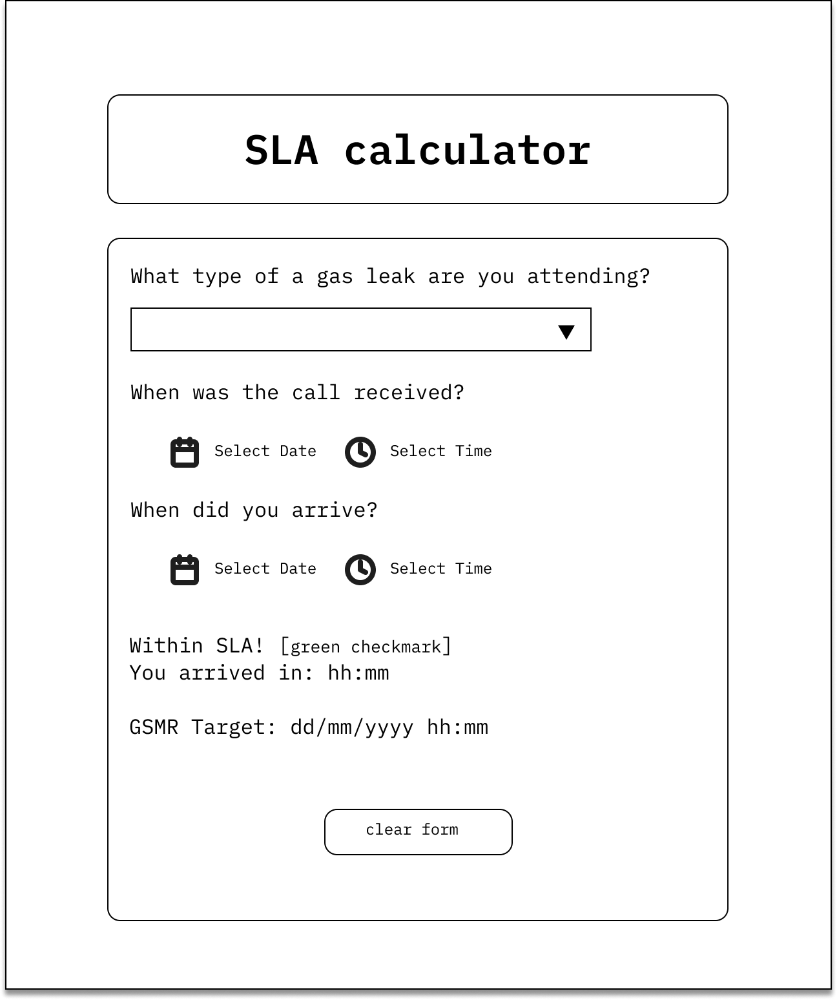
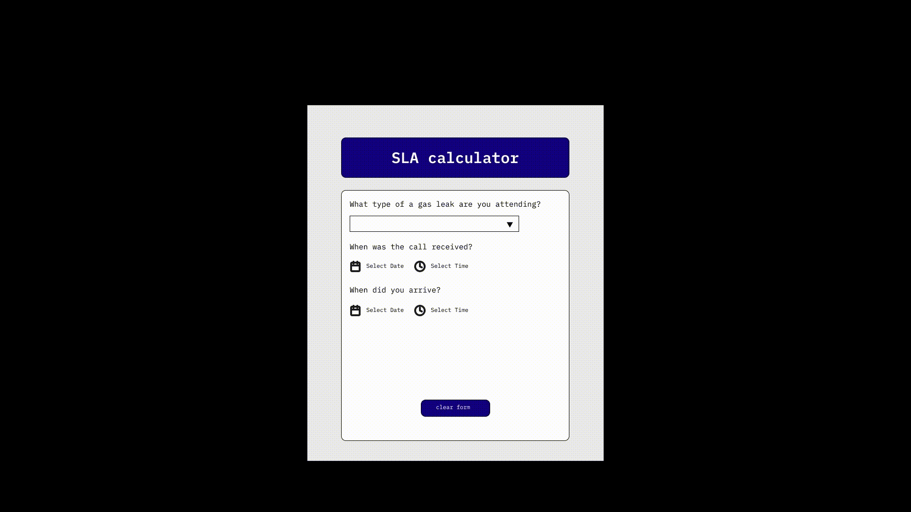

# SLA calculator for gas engineers 🛠️

This repository contains code and documentation for Summative One assessment in Software Engineering. 
Created by Hugborg Hudson.

---
## 1. Product Proposal ✨
The SLA Calculator is a lightweight, browser-based tool designed to help gas engineers quickly determine whether they attended a gas leak callout within their required Service Level Agreement (SLA) window.

When attending a gas leak callouts, engineers are required to arrive within a set timeframe determined by the nature of the leak. These timeframes, defined under GSMR (Gas Safety Management Regulations), vary depending on whether the leak is classified as Controlled, Unccontrolled, or Priority. Currently, determining SLA compliance requires manually calculating the difference between the time a call was received and the time of arrival, then comparing it against the relevant target. This process is error-prone, time consuming, and adds unnecessary pressure in an already high stakes environment.

The SLA Calculator removes the mental arithmetic entirely. Then engineer selects the leak, type, inputs the time the call was received, and inputs their arrival time. The app instantly calculates whether they arrived within the SLA timeframe, displays the time taken to arrive onsite, and shows the exact deadline they are working towards for turning off the leak. The result is a clear, unambiguous compliance status, either within or outside the SLA.

This tool is intended for gas engineers and their supervisors who need a fast, reliable way to check or record SLA compliance during or after attending a callout. It is designed to work on any device, phone, tablet or desktop with no installation required.

The app is built using HTML, CSS, and JavaScript. This keeps it entierly dependency-free, accessible from any browser, and simple to maintain. No backend or database is needed for the MVP, as the tool performs all calculations client side.

## 2. Design and Prototype 🎨
An initial wireframe was produced to map out the user interface before development began, followed by a high-fidelity prototype built in Figma. Both informed the final layout and interaction design of the MVP.

> ### Wireframe
> 
> **Figure One:** Showing the wireframe for the App Layout
>
> The wireframe outlines the core layout of the SLA Calculator. A dropdown at the top allows the engineer to select the leak type, followed by two date and time input pairs for the call received and arrival time. The results section at the bottom dynamically displays the compliance status, time taken, and GSMR target deadline. A clear form button allows the engineer to rest all fields quickly.
> 
>### Prototype
> 
> **Figure Two:** Showing the gif of the prototype for the App functionality
> 
> The Figma prototype builds on the wireframe with visual styling applied, demonstrating the intended user flow from input through to result. As well as how the user can clear the form at any stage during the process.

## 3. Project Management

## 4. Requirements / Tickets

## 5. Build Narrative

## 6. Testing and CI/CD

## 7. Version Control Strategy

## 8. Documentation

### User guide

### Technical guide

## 9. Ticket Maintenance

## 10. Evaluation
